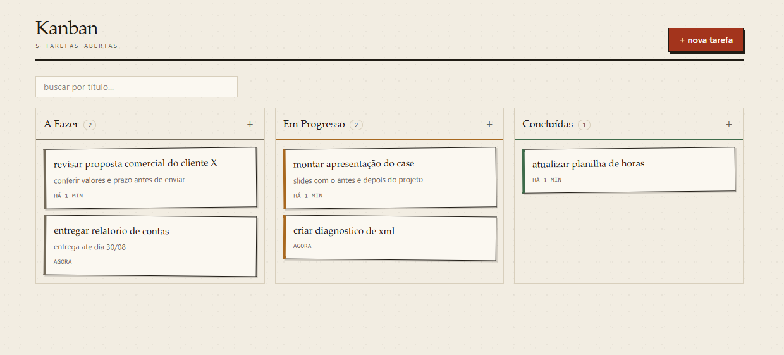
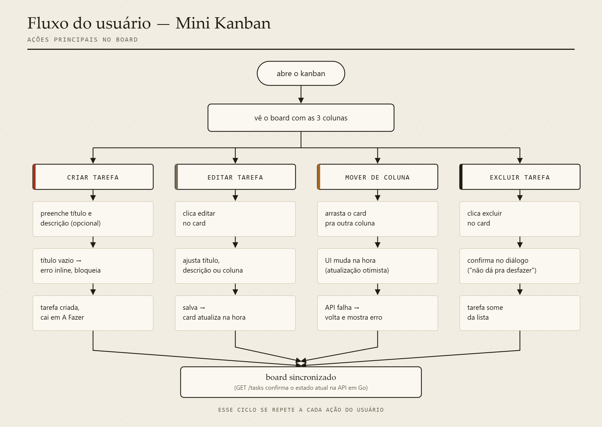
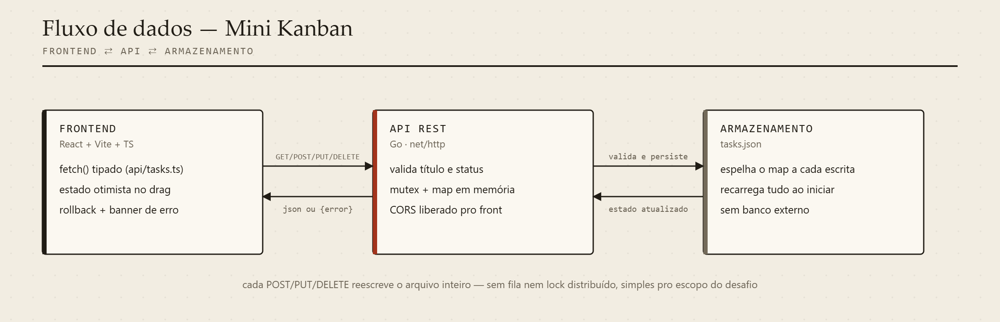

# Mini Kanban

Projeto feito pro desafio técnico do processo seletivo de estágio fullstack da Veritas Consultoria Empresarial. É um kanban simples, com três colunas fixas (A Fazer, Em Progresso, Concluídas), backend em Go e frontend em React + TypeScript.

## Prints



## Funcionalidades

- Três colunas fixas: A Fazer, Em Progresso, Concluídas
- Criar tarefa com título (obrigatório) e descrição (opcional)
- Editar título, descrição e coluna de uma tarefa
- Mover entre colunas arrastando o card ou editando
- Reordenar tarefas dentro da mesma coluna arrastando
- Buscar tarefas por título
- Excluir tarefa, com confirmação antes
- Feedback visual de carregamento e de erro (por exemplo, se o backend cair)
- Dados persistidos via API REST em Go, salvos em arquivo JSON

## Como rodar

### Backend

```
cd backend
go run .
```

Sobe em `http://localhost:8080`. Variáveis de ambiente, todas opcionais:

| variável | padrão |
|---|---|
| `PORT` | `8080` |
| `DATA_FILE` | `tasks.json` |
| `ALLOWED_ORIGIN` | `http://localhost:5173` |

Pra rodar os testes do backend:

```
cd backend
go test ./...
```

### Frontend

```
cd frontend
npm install
npm run dev
```

Sobe em `http://localhost:5173`. Se a API estiver rodando em outro endereço, copia o `.env.example` pra `.env` e ajusta o `VITE_API_URL`.

Pra rodar os testes do frontend:

```
cd frontend
npm run test
```

### Com Docker (bônus)

```
docker compose up --build
```

Sobe o backend na `:8080` e o frontend na `:5173`. O `tasks.json` fica num volume, então não some se você derrubar os containers.

## Arquitetura

O backend e o frontend são dois projetos separados que só se falam por HTTP, cada um na sua pasta.

**Backend** (`/backend`), dividido por responsabilidade:
- `models.go`: os tipos (`Task`, `Status`) e a validação de status
- `store.go`: acesso aos dados, guarda em memória e espelha em `tasks.json`
- `handlers.go`: regra da API (valida entrada, monta resposta, código de status)
- `router.go`: mapeia cada rota pro handler certo
- `main.go`: lê configuração e sobe o servidor

**Frontend** (`/frontend/src`):
- `api/`: cliente HTTP tipado, isola o `fetch` do resto da aplicação
- `types.ts`: os tipos compartilhados entre os componentes
- `components/`: `Board` organiza o drag and drop, `Column` mostra a lista de uma coluna, `TaskCard` só exibe uma tarefa, cada um cuidando só da própria parte
- `App.tsx`: dono do estado (lista de tarefas, modal aberto, erro) e de quem chama a API

## Boas práticas aplicadas

- Separação por camada: validação fica no handler, persistência no store, e os componentes de tela não sabem nada sobre como os dados são salvos.
- Tipagem forte de ponta a ponta, sem `any` no TypeScript e com structs tipadas no Go.
- Toda chamada de rede trata erro, nunca falha silenciosa.
- Testes automatizados nas duas pontas (Go e Vitest), cobrindo validação e os casos de erro, não só o caminho feliz.
- Sem dependência que não se paga: cada lib usada tem um motivo (Tailwind pro estilo, Testing Library pros testes), nada além disso.
- Commits pequenos, cada um com uma mudança só, em vez de um único commit com o projeto inteiro.

## Decisões técnicas

Fui tentando manter tudo o mais simples possível, sem adicionar coisa que não precisava pro tamanho do projeto:

- **Backend em Go puro, sem framework.** Não usei Gin nem Echo. O `ServeMux` do Go 1.22 já dá conta de rotear por método e path (`PUT /tasks/{id}`), então trazer uma dependência a mais não ia agregar nada aqui.
- **Sem banco de dados.** As tarefas ficam guardadas num map em memória (protegido por mutex) e são salvas em `tasks.json` toda vez que algo muda. Quando o servidor sobe, ele lê esse arquivo de novo. É persistência suficiente pro escopo do desafio, sem precisar configurar driver nem migração.
- **Drag and drop sem biblioteca.** Usei a API nativa de drag and drop do HTML5. Com só três colunas e uma lista simples em cada uma, trazer `dnd-kit` ou parecido ia ser peso morto.
- **Atualização otimista ao arrastar.** Quando você solta o card em outra coluna, a tela já atualiza na hora. Se o servidor recusar por algum motivo, o card volta pro lugar e aparece um aviso de erro. Já criar e editar esperam a resposta da API antes de fechar a janela, porque ali faz mais sentido o usuário ver a confirmação.
- **Sem Redux nem Zustand.** O estado da aplicação inteira é a lista de tarefas, cabe tranquilo num `useState` no componente principal.
- **Testes focados nos endpoints da API**, não na camada de armazenamento isolada, porque é ali que fica o comportamento que realmente importa (validação, código de status, corpo da resposta).
- **Reordenar como endpoint próprio.** Em vez de colocar a ordem dentro do `PUT /tasks/{id}` normal, criei um `PUT /tasks/reorder` que recebe a lista de ids na nova ordem e reatribui a posição de cada um de uma vez. Fica mais simples do que ficar calculando posição fracionária a cada arraste.

## Desafios que tive

Fazendo esse projeto em três dias, teve algumas partes que me travaram mais do que eu esperava:

A que mais me deu trabalho foi o visual. Minha primeira versão saiu com uma cara bem genérica, tipo qualquer dashboard que a gente vê por aí, e eu não queria isso. Refiz o design pensando em algo com mais identidade, misturando uma fonte serifada com uma mono, cores mais neutras e uns detalhes de sombra e borda que fogem do padrão "arredondado com gradiente" que todo mundo usa hoje em dia.

O drag and drop também me deu uma dor de cabeça. Em alguns testes o card não mudava de coluna quando eu soltava rápido demais. Fui investigar com calma e descobri que eu tava lendo o id da tarefa de um jeito que podia não ter atualizado a tempo do soltar. Troquei pra pegar esse id direto do próprio evento de arrastar, e resolveu.

CORS também me pegou no começo: esqueci de liberar a origem certa entre frontend e backend e fiquei um tempo sem entender por que as requisições sumiam sem erro nenhum aparecendo.

Com três dias, teve que decidir rápido o que priorizar. Deixei o CRUD, a fluidez entre colunas e o drag and drop prontos primeiro, porque é o que mais pesa na nota. Documentação, Docker e os testes extras vieram depois, com o tempo que sobrou.

## Limitações conhecidas

- Não tem autenticação. Qualquer requisição na API consegue mexer nas tarefas.
- A persistência é num arquivo só: cada mudança reescreve o `tasks.json` inteiro. Funciona bem pra um board pessoal, mas não aguentaria muita escrita concorrente.
- Não tem paginação, a lista inteira carrega de uma vez (mas dá pra filtrar por título na busca).

## O que eu faria com mais tempo

- Trocar o `tasks.json` por um banco tipo SQLite se o board crescesse de verdade.
- Autenticação básica, caso precisasse virar multiusuário.
- Mais testes de componente no frontend, hoje só cobri o formulário e o formatador de data.

## Documentação

**User flow:** fluxo das principais ações do usuário no board.



**Fluxo de dados:** como os dados trafegam entre frontend, API e armazenamento.


